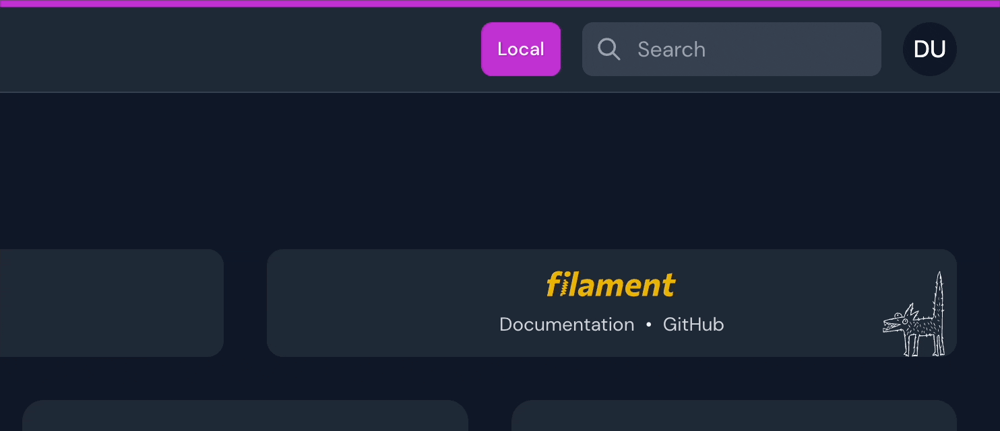

# Filament Environment Indicator

[](https://packagist.org/packages/pxlrbt/filament-environment-indicator)
[](LICENSE.md)

[](https://packagist.org/packages/pxlrbt/filament-environment-indicator)

Never confuse your tabs with different Filament environments again.



## Installation via Composer

**Requires PHP > 8.0 and Filament > 2.10.34**

```bash
composer require pxlrbt/filament-environment-indicator
```

## Configuration

Out of the box, this plugin adds a colored border to the top of the admin panel and a badge next to the search bar.

You can customize any behaviour, by using Filament's `::configureUsing()` syntax inside your ServiceProviders `boot()` method.

### Visibility

By default, the package checks whether you have Spatie permissions plugin installed and checks for a role called `super_admin`. You can further customize whether the indicators should be shown.

```php
 FilamentEnvironmentIndicator::configureUsing(function (FilamentEnvironmentIndicator $indicator) {
    $indicator->visible = fn () => auth()->user()?->can('see_indicator');
}, isImportant: true);
```

### Colors

You can overwrite the default colors if you want your own colors or need to add more. The color accepts any CSS color value.

```php
 FilamentEnvironmentIndicator::configureUsing(function (FilamentEnvironmentIndicator $indicator) {
    $indicator->color = fn () => match (app()->environment()) {
        'production' => null,
        'staging' => 'orange',
        default => 'blue',
    };
}, isImportant: true);
```

### Indicators

By default, both indicators are displayed. You can turn them off separately.

```php
 FilamentEnvironmentIndicator::configureUsing(function (FilamentEnvironmentIndicator $indicator) {
    $indicator->showBadge = fn () => false;
    $indicator->showBorder = fn () => true;
}, isImportant: true);
```

## Contributing

If you want to contribute to this packages, you may want to test it in a real Filament project:

- Fork this repository to your GitHub account.
- Create a Filament app locally.
- Clone your fork in your Filament app's root directory.
- In the `/filament-environment-indicator` directory, create a branch for your fix, e.g. `fix/error-message`.

Install the packages in your app's `composer.json`:

```json
"require": {
    "pxlrbt/filament-environment-indicator": "dev-fix/error-message as main-dev",
},
"repositories": [
    {
        "type": "path",
        "url": "filament-environment-indicator"
    }
]
```

Now, run `composer update`.

## Credits
- [Dennis Koch](https://github.com/pxlrbt)
- [All Contributors](../../contributors)
